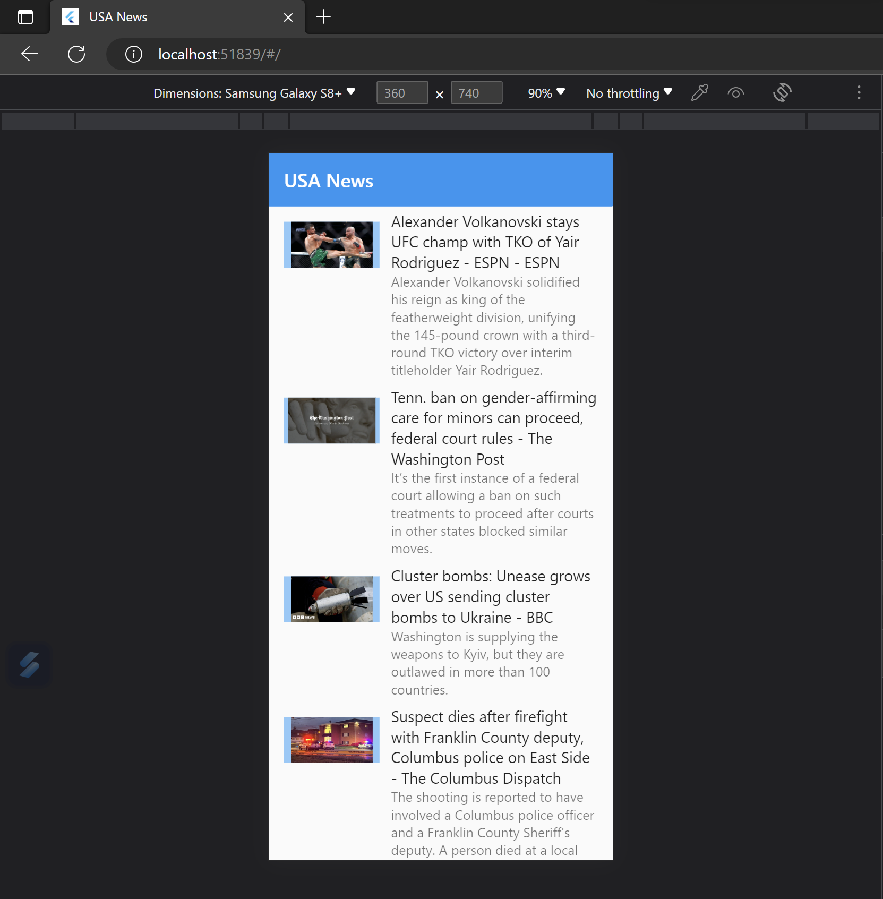

# UAS PEMPROGRAMAN MOBILE 2
***Nama : Choky Andriano***<br>
***Nim : 312110322***<br>
***Kelas : TI.21.A3***

<br>

## Tech Stack
- Flutter
- Dart

<br>

## Features
- Menampilkan berita - berita yang terjadi di Amerika Serikat
- Bahasa yang digunakan adalah teks Berbahasa Inggris

<br>

## API Reference
```py
  GET  https://newsapi.org/v2/top-headlines?country=us&apiKey=679ad85a318b43c2b37bd22818f06f98
```

<br>

## Demo
<div align='center'>
  
</div>
